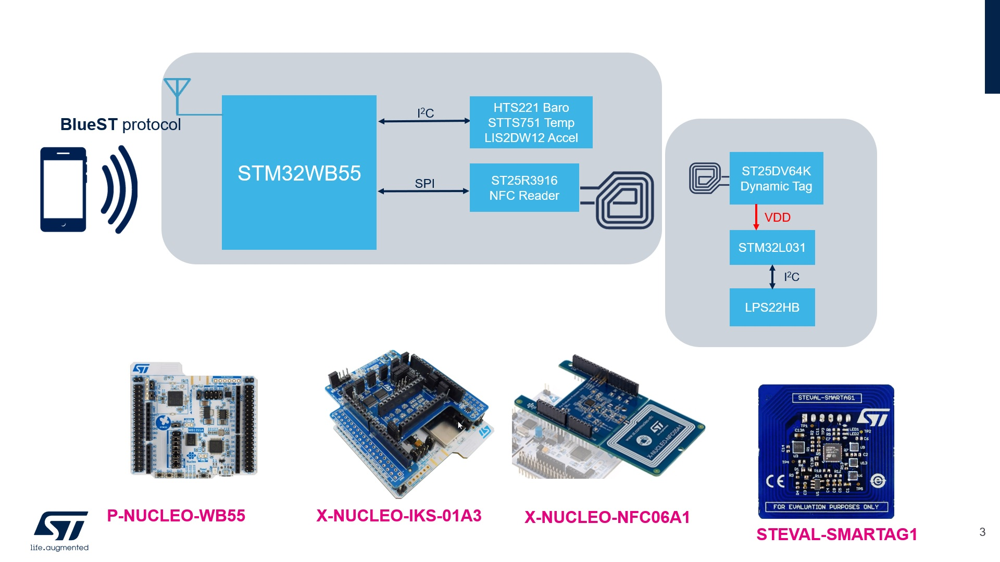

# STM32-Hotspot/STM32WB-BLE-NFC-Reader MCU Firmware Package, based on FP-SNS-MOTENVWB1 Release 1.0.0

## Example

This Hotspot FW package includes:
* Application example under "Projects\P-NUCLEO-WB55.Nucleo\Applications\MOTENV1" called "MOTENV1", is based on the FP-SNS-MOTENVWB1 function pack, which demonstrates BLE connectivity and environmental and motion sensors, but in addition, it includes the driver for the ST25R3916 device (NFC reader) to demonstrate reading a dynamic tag such as the ST25DV64K from the STM32WB and forward the read data to the BLE Sensors smartphone app via BLE.  

The software runs on the STM32WB and includes the necessary drivers to recognize the devices on the STM32WB board, X-NUCLEO-IKS01A3 and X-NUCLEO-NFC06A1 expansion boards. 

For the content of this package, the development toolchains and compilers to use and the supported devices and evaluation boards, refer to the Release Notes in the root directory of this package.

The simplest way to start using this expansion software is to run the sample applications in "Projects\P-NUCLEO-WB55.Nucleo\Applications\MOTENV1".

   * Development tools, toolchains/compilers: IAR EWARM V9.30.1, STM32CubeIDE v1.8.0
   * Supported Devices and hardware boards: NUCLEO-WB55RG (MB1355)
   * Known limitations: None

## Boards Needed

  * One NUCLEO-WB55RG (MB1355)
    * [NUCLEO-WB55RG](https://www.st.com/en/evaluation-tools/nucleo-wb55rg.html)
    * [X-NUCLEO-IKS01A3](https://www.st.com/en/ecosystems/x-nucleo-iks01a3.html)
    * [X-NUCLEO-NFC06A1](https://www.st.com/en/ecosystems/x-nucleo-nfc06a1.html)
    * [STEVAL-SMARTAG1](https://www.st.com/en/evaluation-tools/steval-smartag1.html)	

## Boards Needed
    * [STBLESensor](https://www.st.com/en/embedded-software/stblesensor.html)
	
## User's Guide 

The readme.txt included in the Applications folder provides the description of the application and the instructions on how to run it.
 

## Troubleshooting

**Caution** : Issues and the pull-requests are **not supported** to submit problems or suggestions related to the software delivered in this repository. The STM32WB-BLE-NFC-Reader example is being delivered as-is, and not necessarily supported by ST.

**For any other question** related to the product, the hardware performance or characteristics, the tools, the environment, you can submit it to the **ST Community** on the STM32 MCUs related [page](https://community.st.com/s/topic/0TO0X000000BSqSWAW/stm32-mcus).
